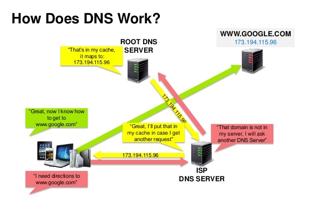
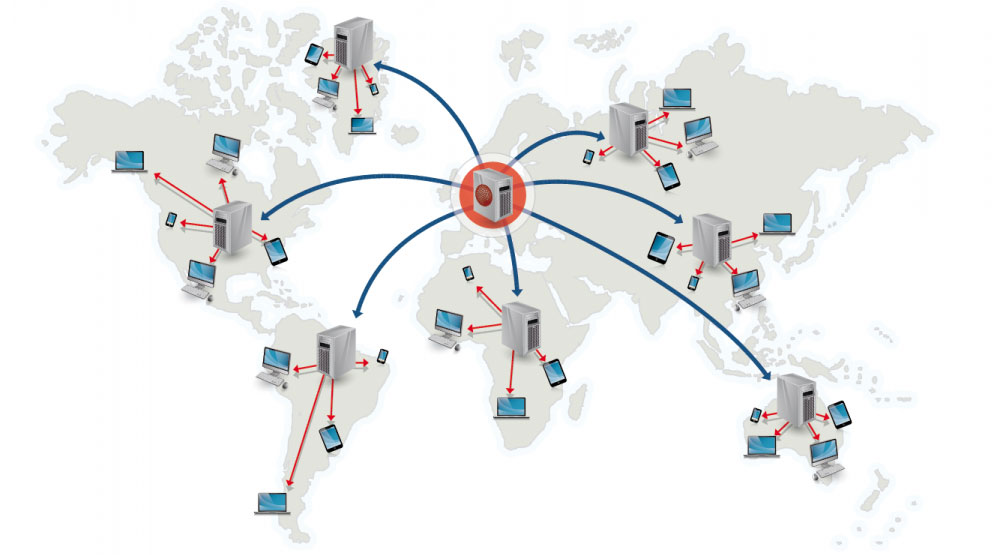

# System Design Topics

New to system design? First, you'll need a basic understanding of common principles, learning about what they are, how they are used, and their pros and cons.

- Step 1: Review a lecture on scalability
- Step 2: Review a set of articles on scalability
- Step 3: Review system design topics

**Step 1: Review a lecture on scalability**

[Harvard CS75 - Lecture 9:  Scalability](https://www.youtube.com/watch?v=-W9F__D3oY4)

Topics covered:

* Vertical scaling
* Horizontal scaling
* Caching
* Load balancing
* Database replication
* Database partitioning

**Step 2: Review a set of articles on scalability**

[Le Cloud Blog: Scalability for Dummies](http://www.lecloud.net/tagged/scalability/chrono)

Topics covered:

* [Clones](http://www.lecloud.net/post/7295452622/scalability-for-dummies-part-1-clones)
* [Databases](http://www.lecloud.net/post/7994751381/scalability-for-dummies-part-2-database)
* [Caches](http://www.lecloud.net/post/9246290032/scalability-for-dummies-part-3-cache)
* [Asynchronism](http://www.lecloud.net/post/9699762917/scalability-for-dummies-part-4-asynchronism)

**Step 2: Review system design topics**

Review the rest of this page! 😄


## Performance vs Scalability
A service is **scalable** if it results in increased **performance** in a manner proportional to resources added. Generally, increasing performance means serving more units of work, but it can also be to handle larger units of work, such as when datasets grow.<sup><a href=http://www.allthingsdistributed.com/2006/03/a_word_on_scalability.html>1</a></sup>

Another way to look at performance vs scalability:

* If you have a **performance** problem, your system is slow for a single user.
* If you have a **scalability** problem, your system is fast for a single user but slow under heavy load.

**Source(s) and further reading**

* [A word on scalability](http://www.allthingsdistributed.com/2006/03/a_word_on_scalability.html)
* [Scalability, availability, stability, patterns](http://www.slideshare.net/jboner/scalability-availability-stability-patterns/)

## Latency vs Throughput
- **Latency** is the time to perform some action or to produce some result.
- **Throughput** is the number of such actions or results per unit of time.

Generally, you should aim for **maximal throughput** with **acceptable latency**.

**Source(s) and further reading**

* [Understanding latency vs throughput](https://community.cadence.com/cadence_blogs_8/b/sd/archive/2010/09/13/understanding-latency-vs-throughput)

## Availability vs Consistency
**CAP theorem**

<p align="center">
  
  <br/>
  <i><a href=http://robertgreiner.com/2014/08/cap-theorem-revisited>Source: CAP theorem revisited</a></i>
</p>

In a distributed computer system, you can only support two of the following guarantees:

* **Consistency** - Every read receives the most recent write or an error
* **Availability** - Every request receives a response, without guarantee that it contains the most recent version of the information
* **Partition Tolerance** - The system continues to operate despite arbitrary partitioning due to network failures

Networks aren't reliable, so you'll need to support partition tolerance. You'll need to make a **software tradeoff** between **consistency** and **availability**:

- CP - consistency and partition tolerance
- AP - availability and partition tolerance

**CP - consistency and partition tolerance**

Waiting for a response from the partitioned node might result in a **timeout error**. CP is a good choice if your business needs require atomic reads and writes.

**AP - availability and partition tolerance**

Responses return the most readily available version of the data available on any node, which **might not be the latest**. Writes might take some time to propagate when the partition is resolved.

AP is a good choice if the business needs allow for [eventual consistency](#eventual-consistency) or when the system needs to continue working despite external errors.

**Source(s) and further reading**

* [CAP theorem revisited](http://robertgreiner.com/2014/08/cap-theorem-revisited/)
* [A plain english introduction to CAP theorem](http://ksat.me/a-plain-english-introduction-to-cap-theorem)
* [CAP FAQ](https://github.com/henryr/cap-faq)
* [The CAP theorem](https://www.youtube.com/watch?v=k-Yaq8AHlFA)

## Consistency patterns
With multiple copies of the same data, we are faced with options on how to synchronize them so clients have a consistent view of the data. Recall the definition of consistency from the [CAP theorem](#cap-theorem) - Every read receives the most recent write or an error.

- Weak consistency
- Eventual consistency
- Strong consistency

**Weak consistency**

After a write, reads may or may not see it. A best effort approach is taken.

This approach is seen in systems such as memcached.  Weak consistency works well in real time use cases such as VoIP, video chat, and realtime multiplayer games.  For example, if you are on a phone call and lose reception for a few seconds, when you regain connection you do not hear what was spoken during connection loss.

**Eventual consistency**

After a write, reads will eventually see it (typically within milliseconds). Data is replicated **asynchronously**.

This approach is seen in systems such as DNS and email. Eventual consistency works well in highly available systems.

**Strong consistency**
After a write, reads will see it.  Data is replicated **synchronously**.

This approach is seen in file systems and RDBMSes. Strong consistency works well in systems that need transactions.

**Source(s) and further reading**

* [Transactions across data centers](http://snarfed.org/transactions_across_datacenters_io.html)

## Availability patterns
There are two complementary patterns to support high availability: **fail-over** and **replication**.

- Fail-over
- Replication

### Fail-over
**Active-passive fail-over** 

In **active-passive fail-over** (AKA master-slave fail-over), heartbeats are sent between the active and the passive server on standby. If the heartbeat is interrupted, the passive server takes over the active's IP address and resumes service.

The length of downtime is determined by whether the passive server is already running in 'hot' standby or whether it needs to start up from 'cold' standby. Only the active server handles traffic.

**Active-active fail-over**

In **active-active fail-over** (AKA master-slave fail-over), both servers are managing traffic, spreading the load between them.

If the servers are public-facing, the DNS would need to know about the public IPs of both servers. If the servers are internal-facing, application logic would need to know about both servers.

**Fail-over disadvantages**

* Fail-over adds more hardware and additional complexity.
* There is a potential for loss of data if the active system fails before any newly written data can be replicated to the passive.

### Replication
This topic is further discussed in the [Database](#database) section:

* [Master-slave replication](#master-slave-replication)
* [Master-master replication](#master-master-replication)

## Availability in numbers
Availability is often quantified by uptime (or downtime) as a percentage of time the service is available.  Availability is generally measured in number of 9s--a service with 99.99% availability is described as having four 9s.

**99.9% availability - three 9s**

| Duration            | Acceptable downtime|
|---------------------|--------------------|
| Downtime per year   | 8h 45min 57s       |
| Downtime per month  | 43m 49.7s          |
| Downtime per week   | 10m 4.8s           |
| Downtime per day    | 1m 26.4s           |

**99.99% availability - four 9s**

| Duration            | Acceptable downtime|
|---------------------|--------------------|
| Downtime per year   | 52min 35.7s        |
| Downtime per month  | 4m 23s             |
| Downtime per week   | 1m 5s              |
| Downtime per day    | 8.6s               |

### Availability in-parallel vs in-sequence

If a service consists of multiple components prone to failure, the service's overall availability depends on whether the components are in sequence or in parallel.

**In-sequence**

Overall availability decreases when two components with availability < 100% are in sequence:

```
Availability (Total) = Availability (Foo) * Availability (Bar)
```

If both `Foo` and `Bar` each had 99.9% availability, their total availability in sequence would be 99.8%.

**In-parallel**

Overall availability increases when two components with availability < 100% are in parallel:

```
Availability (Total) = 1 - (1 - Availability (Foo)) * (1 - Availability (Bar))
```

If both `Foo` and `Bar` each had 99.9% availability, their total availability in parallel would be 99.9999%.

## Domain Name System (DNS)

<p align="center">
  
  <br/>
  <i><a href=http://www.slideshare.net/srikrupa5/dns-security-presentation-issa>Source: DNS security presentation</a></i>
</p>

A Domain Name System (DNS) translates a domain name such as www.example.com to an IP address.

DNS is **hierarchical**, with a few **authoritative servers** at the top level.  Your router or ISP provides information about which DNS server(s) to contact when doing a lookup.  Lower level DNS servers cache mappings, which could become stale due to DNS propagation delays.  DNS results can also be cached by your browser or OS for a certain period of time, determined by the [time to live (TTL)](https://en.wikipedia.org/wiki/Time_to_live).

* **NS record (name server)** - Specifies the DNS servers for your domain/subdomain.
* **MX record (mail exchange)** - Specifies the mail servers for accepting messages.
* **A record (address)** - Points a name to an IP address.
* **CNAME (canonical)** - Points a name to another name or `CNAME` (example.com to www.example.com) or to an `A` record.

Services such as [CloudFlare](https://www.cloudflare.com/dns/) and [Route 53](https://aws.amazon.com/route53/) provide managed DNS services.  Some DNS services can route traffic through various methods:

* [Weighted round robin](https://www.g33kinfo.com/info/round-robin-vs-weighted-round-robin-lb)
    * Prevent traffic from going to servers under maintenance
    * Balance between varying cluster sizes
    * A/B testing
* [Latency-based](https://docs.aws.amazon.com/Route53/latest/DeveloperGuide/routing-policy.html#routing-policy-latency)
* [Geolocation-based](https://docs.aws.amazon.com/Route53/latest/DeveloperGuide/routing-policy.html#routing-policy-geo)

**Disadvantages of DNS**

* Accessing a DNS server introduces a slight delay, although mitigated by caching described above.
* DNS server management could be complex and is generally managed by [governments, ISPs, and large companies](http://superuser.com/questions/472695/who-controls-the-dns-servers/472729).
* DNS services have recently come under [DDoS attack](http://dyn.com/blog/dyn-analysis-summary-of-friday-october-21-attack/), preventing users from accessing websites such as Twitter without knowing Twitter's IP address(es).

**Source(s) and further reading**

* [DNS architecture](https://technet.microsoft.com/en-us/library/dd197427(v=ws.10).aspx)
* [Wikipedia](https://en.wikipedia.org/wiki/Domain_Name_System)
* [DNS articles](https://support.dnsimple.com/categories/dns/)


## Content Delivery Network (CDN)

<p align="center">
  
  <br/>
  <i><a href=https://www.creative-artworks.eu/why-use-a-content-delivery-network-cdn>Source: Why use a CDN</a></i>
</p>

A Content Delivery Network (CDN) is a **globally distributed network of proxy servers**, serving content from locations closer to the user.  Generally, static files such as HTML/CSS/JS, photos, and videos are served from CDN, although some CDNs such as Amazon's CloudFront support dynamic content.  The site's DNS resolution will tell clients which server to contact.

Serving content from CDNs can significantly improve performance in two ways:

* Users receive content from data centers close to them
* Your servers do not have to serve requests that the CDN fulfills

There are two tipes of CDNs:
- Push CDNs
- Pull CDNs

**Push CDNs**

Push CDNs **receive new content** whenever changes occur on your server.  You take full responsibility for providing content, **uploading directly** to the CDN and rewriting URLs to point to the CDN.  You can configure when content expires and when it is updated.  Content is uploaded only when it is new or changed, minimizing traffic, but maximizing storage.

Sites with a **small amount of traffic** or sites with content that isn't often updated work well with push CDNs.  Content is placed on the CDNs once, instead of being re-pulled at regular intervals.

**Pull CDNs**

Pull CDNs **grab new content** from your server when the first user requests the content.  You leave the content on your server and rewrite URLs to point to the CDN.  This results in a slower request until the content is cached on the CDN.

A [time-to-live (TTL)](https://en.wikipedia.org/wiki/Time_to_live) determines how long content is cached.  Pull CDNs **minimize storage space** on the CDN, but can create redundant traffic if files expire and are pulled before they have actually changed.

Sites with **heavy traffic** work well with pull CDNs, as traffic is spread out more evenly with only recently-requested content remaining on the CDN.

**Disadvantages of CDNs**

* CDN costs could be significant depending on traffic, although this should be weighed with additional costs you would incur not using a CDN.
* Content might be stale if it is updated before the TTL expires it.
* CDNs require changing URLs for static content to point to the CDN.

**Source(s) and further reading**
* [Globally distributed content delivery](https://figshare.com/articles/Globally_distributed_content_delivery/6605972)
* [The differences between push and pull CDNs](http://www.travelblogadvice.com/technical/the-differences-between-push-and-pull-cdns/)
* [Wikipedia](https://en.wikipedia.org/wiki/Content_delivery_network)
