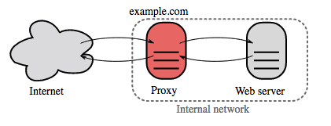

# System Design Topics

New to system design? First, you'll need a basic understanding of common principles, learning about what they are, how they are used, and their pros and cons.

- Step 1: Review a lecture on scalability
- Step 2: Review a set of articles on scalability
- Step 3: Review system design topics

**Step 1: Review a lecture on scalability**

[Harvard CS75 - Lecture 9:  Scalability](https://www.youtube.com/watch?v=-W9F__D3oY4)

Topics covered:

* Vertical scaling
* Horizontal scaling
* Caching
* Load balancing
* Database replication
* Database partitioning

**Step 2: Review a set of articles on scalability**

[Le Cloud Blog: Scalability for Dummies](http://www.lecloud.net/tagged/scalability/chrono)

Topics covered:

* [Clones](http://www.lecloud.net/post/7295452622/scalability-for-dummies-part-1-clones)
* [Databases](http://www.lecloud.net/post/7994751381/scalability-for-dummies-part-2-database)
* [Caches](http://www.lecloud.net/post/9246290032/scalability-for-dummies-part-3-cache)
* [Asynchronism](http://www.lecloud.net/post/9699762917/scalability-for-dummies-part-4-asynchronism)

**Step 2: Review system design topics**

Review the rest of this page! 😄


## Performance vs Scalability
A service is **scalable** if it results in increased **performance** in a manner proportional to resources added. Generally, increasing performance means serving more units of work, but it can also be to handle larger units of work, such as when datasets grow.<sup><a href=http://www.allthingsdistributed.com/2006/03/a_word_on_scalability.html>1</a></sup>

Another way to look at performance vs scalability:

* If you have a **performance** problem, your system is slow for a single user.
* If you have a **scalability** problem, your system is fast for a single user but slow under heavy load.

**Source(s) and further reading**

* [A word on scalability](http://www.allthingsdistributed.com/2006/03/a_word_on_scalability.html)
* [Scalability, availability, stability, patterns](http://www.slideshare.net/jboner/scalability-availability-stability-patterns/)

## Latency vs Throughput
- **Latency** is the time to perform some action or to produce some result.
- **Throughput** is the number of such actions or results per unit of time.

Generally, you should aim for **maximal throughput** with **acceptable latency**.

**Source(s) and further reading**

* [Understanding latency vs throughput](https://community.cadence.com/cadence_blogs_8/b/sd/archive/2010/09/13/understanding-latency-vs-throughput)

## Availability vs Consistency
**CAP theorem**

<p align="center">
  
  <br/>
  <i><a href=http://robertgreiner.com/2014/08/cap-theorem-revisited>Source: CAP theorem revisited</a></i>
</p>

In a distributed computer system, you can only support two of the following guarantees:

* **Consistency** - Every read receives the most recent write or an error
* **Availability** - Every request receives a response, without guarantee that it contains the most recent version of the information
* **Partition Tolerance** - The system continues to operate despite arbitrary partitioning due to network failures

Networks aren't reliable, so you'll need to support partition tolerance. You'll need to make a **software tradeoff** between **consistency** and **availability**:

- CP - consistency and partition tolerance
- AP - availability and partition tolerance

**CP - consistency and partition tolerance**

Waiting for a response from the partitioned node might result in a **timeout error**. CP is a good choice if your business needs require atomic reads and writes.

**AP - availability and partition tolerance**

Responses return the most readily available version of the data available on any node, which **might not be the latest**. Writes might take some time to propagate when the partition is resolved.

AP is a good choice if the business needs allow for [eventual consistency](#eventual-consistency) or when the system needs to continue working despite external errors.

**Source(s) and further reading**

* [CAP theorem revisited](http://robertgreiner.com/2014/08/cap-theorem-revisited/)
* [A plain english introduction to CAP theorem](http://ksat.me/a-plain-english-introduction-to-cap-theorem)
* [CAP FAQ](https://github.com/henryr/cap-faq)
* [The CAP theorem](https://www.youtube.com/watch?v=k-Yaq8AHlFA)

## Consistency patterns
With multiple copies of the same data, we are faced with options on how to synchronize them so clients have a consistent view of the data. Recall the definition of consistency from the [CAP theorem](#cap-theorem) - Every read receives the most recent write or an error.

- Weak consistency
- Eventual consistency
- Strong consistency

**Weak consistency**

After a write, reads may or may not see it. A best effort approach is taken.

This approach is seen in systems such as memcached.  Weak consistency works well in real time use cases such as VoIP, video chat, and realtime multiplayer games.  For example, if you are on a phone call and lose reception for a few seconds, when you regain connection you do not hear what was spoken during connection loss.

**Eventual consistency**

After a write, reads will eventually see it (typically within milliseconds). Data is replicated **asynchronously**.

This approach is seen in systems such as DNS and email. Eventual consistency works well in highly available systems.

**Strong consistency**
After a write, reads will see it.  Data is replicated **synchronously**.

This approach is seen in file systems and RDBMSes. Strong consistency works well in systems that need transactions.

**Source(s) and further reading**

* [Transactions across data centers](http://snarfed.org/transactions_across_datacenters_io.html)

## Availability patterns
There are two complementary patterns to support high availability: **fail-over** and **replication**.

- Fail-over
- Replication

### Fail-over
**Active-passive fail-over** 

In **active-passive fail-over** (AKA master-slave fail-over), heartbeats are sent between the active and the passive server on standby. If the heartbeat is interrupted, the passive server takes over the active's IP address and resumes service.

The length of downtime is determined by whether the passive server is already running in 'hot' standby or whether it needs to start up from 'cold' standby. Only the active server handles traffic.

**Active-active fail-over**

In **active-active fail-over** (AKA master-slave fail-over), both servers are managing traffic, spreading the load between them.

If the servers are public-facing, the DNS would need to know about the public IPs of both servers. If the servers are internal-facing, application logic would need to know about both servers.

**Fail-over disadvantages**

* Fail-over adds more hardware and additional complexity.
* There is a potential for loss of data if the active system fails before any newly written data can be replicated to the passive.

### Replication
This topic is further discussed in the [Database](#database) section:

* [Master-slave replication](#master-slave-replication)
* [Master-master replication](#master-master-replication)

## Availability in numbers
Availability is often quantified by uptime (or downtime) as a percentage of time the service is available.  Availability is generally measured in number of 9s--a service with 99.99% availability is described as having four 9s.

**99.9% availability - three 9s**

| Duration            | Acceptable downtime|
|---------------------|--------------------|
| Downtime per year   | 8h 45min 57s       |
| Downtime per month  | 43m 49.7s          |
| Downtime per week   | 10m 4.8s           |
| Downtime per day    | 1m 26.4s           |

**99.99% availability - four 9s**

| Duration            | Acceptable downtime|
|---------------------|--------------------|
| Downtime per year   | 52min 35.7s        |
| Downtime per month  | 4m 23s             |
| Downtime per week   | 1m 5s              |
| Downtime per day    | 8.6s               |

### Availability in-parallel vs in-sequence

If a service consists of multiple components prone to failure, the service's overall availability depends on whether the components are in sequence or in parallel.

**In-sequence**

Overall availability decreases when two components with availability < 100% are in sequence:

```
Availability (Total) = Availability (Foo) * Availability (Bar)
```

If both `Foo` and `Bar` each had 99.9% availability, their total availability in sequence would be 99.8%.

**In-parallel**

Overall availability increases when two components with availability < 100% are in parallel:

```
Availability (Total) = 1 - (1 - Availability (Foo)) * (1 - Availability (Bar))
```

If both `Foo` and `Bar` each had 99.9% availability, their total availability in parallel would be 99.9999%.

## Domain Name System (DNS)

<p align="center">
  
  <br/>
  <i><a href=http://www.slideshare.net/srikrupa5/dns-security-presentation-issa>Source: DNS security presentation</a></i>
</p>

A Domain Name System (DNS) translates a domain name such as www.example.com to an IP address.

DNS is **hierarchical**, with a few **authoritative servers** at the top level.  Your router or ISP provides information about which DNS server(s) to contact when doing a lookup.  Lower level DNS servers cache mappings, which could become stale due to DNS propagation delays.  DNS results can also be cached by your browser or OS for a certain period of time, determined by the [time to live (TTL)](https://en.wikipedia.org/wiki/Time_to_live).

* **NS record (name server)** - Specifies the DNS servers for your domain/subdomain.
* **MX record (mail exchange)** - Specifies the mail servers for accepting messages.
* **A record (address)** - Points a name to an IP address.
* **CNAME (canonical)** - Points a name to another name or `CNAME` (example.com to www.example.com) or to an `A` record.

Services such as [CloudFlare](https://www.cloudflare.com/dns/) and [Route 53](https://aws.amazon.com/route53/) provide managed DNS services.  Some DNS services can route traffic through various methods:

* [Weighted round robin](https://www.g33kinfo.com/info/round-robin-vs-weighted-round-robin-lb)
    * Prevent traffic from going to servers under maintenance
    * Balance between varying cluster sizes
    * A/B testing
* [Latency-based](https://docs.aws.amazon.com/Route53/latest/DeveloperGuide/routing-policy.html#routing-policy-latency)
* [Geolocation-based](https://docs.aws.amazon.com/Route53/latest/DeveloperGuide/routing-policy.html#routing-policy-geo)

**Disadvantages of DNS**

* Accessing a DNS server introduces a slight delay, although mitigated by caching described above.
* DNS server management could be complex and is generally managed by [governments, ISPs, and large companies](http://superuser.com/questions/472695/who-controls-the-dns-servers/472729).
* DNS services have recently come under [DDoS attack](http://dyn.com/blog/dyn-analysis-summary-of-friday-october-21-attack/), preventing users from accessing websites such as Twitter without knowing Twitter's IP address(es).

**Source(s) and further reading**

* [DNS architecture](https://technet.microsoft.com/en-us/library/dd197427(v=ws.10).aspx)
* [Wikipedia](https://en.wikipedia.org/wiki/Domain_Name_System)
* [DNS articles](https://support.dnsimple.com/categories/dns/)

## Content Delivery Network (CDN)

<p align="center">
  
  <br/>
  <i><a href=https://www.creative-artworks.eu/why-use-a-content-delivery-network-cdn>Source: Why use a CDN</a></i>
</p>

A Content Delivery Network (CDN) is a **globally distributed network of proxy servers**, serving content from locations closer to the user.  Generally, static files such as HTML/CSS/JS, photos, and videos are served from CDN, although some CDNs such as Amazon's CloudFront support dynamic content.  The site's DNS resolution will tell clients which server to contact.

Serving content from CDNs can significantly improve performance in two ways:

* Users receive content from data centers close to them
* Your servers do not have to serve requests that the CDN fulfills

There are two tipes of CDNs:

- Push CDNs
- Pull CDNs

**Push CDNs**

Push CDNs **receive new content** whenever changes occur on your server.  You take full responsibility for providing content, **uploading directly** to the CDN and rewriting URLs to point to the CDN.  You can configure when content expires and when it is updated.  Content is uploaded only when it is new or changed, minimizing traffic, but maximizing storage.

Sites with a **small amount of traffic** or sites with content that isn't often updated work well with push CDNs.  Content is placed on the CDNs once, instead of being re-pulled at regular intervals.

**Pull CDNs**

Pull CDNs **grab new content** from your server when the first user requests the content.  You leave the content on your server and rewrite URLs to point to the CDN.  This results in a slower request until the content is cached on the CDN.

A [time-to-live (TTL)](https://en.wikipedia.org/wiki/Time_to_live) determines how long content is cached.  Pull CDNs **minimize storage space** on the CDN, but can create redundant traffic if files expire and are pulled before they have actually changed.

Sites with **heavy traffic** work well with pull CDNs, as traffic is spread out more evenly with only recently-requested content remaining on the CDN.

**Disadvantages of CDNs**

* CDN costs could be significant depending on traffic, although this should be weighed with additional costs you would incur not using a CDN.
* Content might be stale if it is updated before the TTL expires it.
* CDNs require changing URLs for static content to point to the CDN.

**Source(s) and further reading**

* [Globally distributed content delivery](https://figshare.com/articles/Globally_distributed_content_delivery/6605972)
* [The differences between push and pull CDNs](http://www.travelblogadvice.com/technical/the-differences-between-push-and-pull-cdns/)
* [Wikipedia](https://en.wikipedia.org/wiki/Content_delivery_network)

## Load balancer

<p align="center">
  
  <br/>
  <i><a href=http://horicky.blogspot.com/2010/10/scalable-system-design-patterns.html>Source: Scalable system design patterns</a></i>
</p>

Load Balancers distribute incoming client requests to computing resources such as application servers and databases.  In each case, the load balancer returns the response from the computing resource to the appropriate client.  Load balancers are effective at:

* Preventing requests from going to unhealthy servers
* Preventing overloading resources
* Helping to eliminate a single point of failure

Load balancers can be implemented with hardware (expensive) or with software such as HAProxy.

Additional benefits include:

* **SSL termination** - Decrypt incoming requests and encrypt server responses so backend servers do not have to perform these potentially expensive operations
    * Removes the need to install [X.509 certificates](https://en.wikipedia.org/wiki/X.509) on each server
* **Session persistence** - Issue cookies and route a specific client's requests to same instance if the web apps do not keep track of sessions

To protect against failures, it's common to set up multiple load balancers, either in active-passive or active-active mode.

Load balancers can route traffic based on various metrics, including:

* Random
* Least loaded
* Session/cookies
* [Round robin or weighted round robin](https://www.g33kinfo.com/info/round-robin-vs-weighted-round-robin-lb)
* [Layer 4](#layer-4-load-balancing)
* [Layer 7](#layer-7-load-balancing)

**Layer 4 load balancing**

Layer 4 load balancers look at info at the [transport layer](#communication) to decide how to distribute requests.  Generally, this involves the source, destination IP addresses, and ports in the header, but not the contents of the packet.  Layer 4 load balancers forward network packets to and from the upstream server, performing [Network Address Translation (NAT)](https://www.nginx.com/resources/glossary/layer-4-load-balancing/).

**Layer 7 load balancing**

Layer 7 load balancers look at the [application layer](#communication) to decide how to distribute requests.  This can involve contents of the header, message, and cookies.  Layer 7 load balancers terminate network traffic, reads the message, makes a load-balancing decision, then opens a connection to the selected server.  For example, a layer 7 load balancer can direct video traffic to servers that host videos while directing more sensitive user billing traffic to security-hardened servers.

At the cost of flexibility, layer 4 load balancing requires less time and computing resources than Layer 7, although the performance impact can be minimal on modern commodity hardware.

**Horizontal scaling**

Load balancers can also help with horizontal scaling, improving performance and availability.  Scaling out using commodity machines is more cost efficient and results in higher availability than scaling up a single server on more expensive hardware, called **Vertical Scaling**.  It is also easier to hire for talent working on commodity hardware than it is for specialized enterprise systems.

**Disadvantages of horizontal scaling**

* Scaling horizontally introduces complexity and involves cloning servers
    * Servers should be stateless: they should not contain any user-related data like sessions or profile pictures
    * Sessions can be stored in a centralized data store such as a [database](#database) (SQL, NoSQL) or a persistent [cache](#cache) (Redis, Memcached)
* Downstream servers such as caches and databases need to handle more simultaneous connections as upstream servers scale out

**Disadvantages of load balancers**

* The load balancer can become a performance bottleneck if it does not have enough resources or if it is not configured properly.
* Introducing a load balancer to help eliminate a single point of failure results in increased complexity.
* A single load balancer is a single point of failure, configuring multiple load balancers further increases complexity.

**Source(s) and further reading**

* [NGINX architecture](https://www.nginx.com/blog/inside-nginx-how-we-designed-for-performance-scale/)
* [HAProxy architecture guide](http://www.haproxy.org/download/1.2/doc/architecture.txt)
* [Scalability](http://www.lecloud.net/post/7295452622/scalability-for-dummies-part-1-clones)
* [Wikipedia](https://en.wikipedia.org/wiki/Load_balancing_(computing))
* [Layer 4 load balancing](https://www.nginx.com/resources/glossary/layer-4-load-balancing/)
* [Layer 7 load balancing](https://www.nginx.com/resources/glossary/layer-7-load-balancing/)
* [ELB listener config](http://docs.aws.amazon.com/elasticloadbalancing/latest/classic/elb-listener-config.html)

## Reverse proxy

<p align="center">
  
  <br/>
  <i><a href=https://upload.wikimedia.org/wikipedia/commons/6/67/Reverse_proxy_h2g2bob.svg>Source: Wikipedia</a></i>
  <br/>
</p>

A reverse proxy is a web server that centralizes internal services and provides unified interfaces to the public.  Requests from clients are forwarded to a server that can fulfill it before the reverse proxy returns the server's response to the client.

Additional benefits include:

* **Increased security** - Hide information about backend servers, blacklist IPs, limit number of connections per client
* **Increased scalability and flexibility** - Clients only see the reverse proxy's IP, allowing you to scale servers or change their configuration
* **SSL termination** - Decrypt incoming requests and encrypt server responses so backend servers do not have to perform these potentially expensive operations
    * Removes the need to install [X.509 certificates](https://en.wikipedia.org/wiki/X.509) on each server
* **Compression** - Compress server responses
* **Caching** - Return the response for cached requests
* **Static content** - Serve static content directly
    * HTML/CSS/JS
    * Photos
    * Videos
    * Etc

**Load balancer vs reverse proxy**

* Deploying a load balancer is useful when you have multiple servers.  Often, load balancers  route traffic to a set of servers serving the same function.
* Reverse proxies can be useful even with just one web server or application server, opening up the benefits described in the previous section.
* Solutions such as NGINX and HAProxy can support both layer 7 reverse proxying and load balancing.

**Disadvantages of reverse proxies**

* Introducing a reverse proxy results in increased complexity.
* A single reverse proxy is a single point of failure, configuring multiple reverse proxies (ie a [failover](https://en.wikipedia.org/wiki/Failover)) further increases complexity.

**Source(s) and further reading**

* [Reverse proxy vs load balancer](https://www.nginx.com/resources/glossary/reverse-proxy-vs-load-balancer/)
* [NGINX architecture](https://www.nginx.com/blog/inside-nginx-how-we-designed-for-performance-scale/)
* [HAProxy architecture guide](http://www.haproxy.org/download/1.2/doc/architecture.txt)
* [Wikipedia](https://en.wikipedia.org/wiki/Reverse_proxy)

## Application layer

<p align="center">
  
  <br/>
  <i><a href=http://lethain.com/introduction-to-architecting-systems-for-scale/#platform_layer>Source: Intro to architecting systems for scale</a></i>
</p>

Separating out the web layer from the application layer (also known as platform layer) allows you to scale and configure both layers independently.  Adding a new API results in adding application servers without necessarily adding additional web servers.  The **single responsibility principle** advocates for small and autonomous services that work together.  Small teams with small services can plan more aggressively for rapid growth.

Workers in the application layer also help enable [asynchronism](#asynchronism).

**Microservices**

Related to this discussion are [microservices](https://en.wikipedia.org/wiki/Microservices), which can be described as a suite of independently deployable, small, modular services.  Each service runs a unique process and communicates through a well-defined, lightweight mechanism to serve a business goal. <sup><a href=https://smartbear.com/learn/api-design/what-are-microservices>1</a></sup>

Pinterest, for example, could have the following microservices: user profile, follower, feed, search, photo upload, etc.

**Service Discovery**

Systems such as [Consul](https://www.consul.io/docs/index.html), [Etcd](https://coreos.com/etcd/docs/latest), and [Zookeeper](http://www.slideshare.net/sauravhaloi/introduction-to-apache-zookeeper) can help services find each other by keeping track of registered names, addresses, and ports.  [Health checks](https://www.consul.io/intro/getting-started/checks.html) help verify service integrity and are often done using an [HTTP](#hypertext-transfer-protocol-http) endpoint.  Both Consul and Etcd have a built in [key-value store](#key-value-store) that can be useful for storing config values and other shared data.

**Disadvantages of an application layer**

* Adding an application layer with loosely coupled services requires a different approach from an architectural, operations, and process viewpoint (vs a monolithic system).
* Microservices can add complexity in terms of deployments and operations.

**Source(s) and further reading**

* [Intro to architecting systems for scale](http://lethain.com/introduction-to-architecting-systems-for-scale)
* [Crack the system design interview](http://www.puncsky.com/blog/2016-02-13-crack-the-system-design-interview)
* [Service oriented architecture](https://en.wikipedia.org/wiki/Service-oriented_architecture)
* [Introduction to Zookeeper](http://www.slideshare.net/sauravhaloi/introduction-to-apache-zookeeper)
* [Here's what you need to know about building microservices](https://cloudncode.wordpress.com/2016/07/22/msa-getting-started/)


## Database

<p align="center">
  
  <br/>
  <i><a href=https://www.youtube.com/watch?v=kKjm4ehYiMs>Source: Scaling up to your first 10 million users</a></i>
</p>

### Relational Database Management System (RDBMS)

A relational database like SQL is a collection of data items organized in tables.

**ACID** is a set of properties of relational database [transactions](https://en.wikipedia.org/wiki/Database_transaction).

* **Atomicity** - Each transaction is all or nothing
* **Consistency** - Any transaction will bring the database from one valid state to another
* **Isolation** - Executing transactions concurrently has the same results as if the transactions were executed serially
* **Durability** - Once a transaction has been committed, it will remain so

There are many techniques to scale a relational database: 

- **Replication**
    - master-slave replication
    - master-master replication
- **Federation**
- **Sharding**
- **Denormalization**
- **SQL tuning**

#### Replication

**Master-slave replication**

The master serves reads and writes, replicating writes to one or more slaves, which serve only reads.  Slaves can also replicate to additional slaves in a tree-like fashion.  If the master goes offline, the system can continue to operate in read-only mode until a slave is promoted to a master or a new master is provisioned.

<p align="center">
  
  <br/>
  <i><a href=http://www.slideshare.net/jboner/scalability-availability-stability-patterns/>Source: Scalability, availability, stability, patterns</a></i>
</p>

Disadvantages of master-slave replication:

* Additional logic is needed to promote a slave to a master.
* See [Disadvantage(s): replication](#disadvantages-replication) for points related to **both** master-slave and master-master.

**Master-master replication**

Both masters serve reads and writes and coordinate with each other on writes.  If either master goes down, the system can continue to operate with both reads and writes.

<p align="center">
  
  <br/>
  <i><a href=http://www.slideshare.net/jboner/scalability-availability-stability-patterns/>Source: Scalability, availability, stability, patterns</a></i>
</p>

Disadvantages of master-master replication:

* You'll need a load balancer or you'll need to make changes to your application logic to determine where to write.
* Most master-master systems are either loosely consistent (violating ACID) or have increased write latency due to synchronization.
* Conflict resolution comes more into play as more write nodes are added and as latency increases.
* See [Disadvantage(s): replication](#disadvantages-replication) for points related to **both** master-slave and master-master.

**Disadvantages of replication**

* There is a potential for loss of data if the master fails before any newly written data can be replicated to other nodes.
* Writes are replayed to the read replicas.  If there are a lot of writes, the read replicas can get bogged down with replaying writes and can't do as many reads.
* The more read slaves, the more you have to replicate, which leads to greater replication lag.
* On some systems, writing to the master can spawn multiple threads to write in parallel, whereas read replicas only support writing sequentially with a single thread.
* Replication adds more hardware and additional complexity.

**Source(s) and further reading: replication**

* [Scalability, availability, stability, patterns](http://www.slideshare.net/jboner/scalability-availability-stability-patterns/)
* [Multi-master replication](https://en.wikipedia.org/wiki/Multi-master_replication)

#### Federation

<p align="center">
  
  <br/>
  <i><a href=https://www.youtube.com/watch?v=kKjm4ehYiMs>Source: Scaling up to your first 10 million users</a></i>
</p>

Federation (or functional partitioning) splits up databases by function.  For example, instead of a single, monolithic database, you could have three databases: **forums**, **users**, and **products**, resulting in less read and write traffic to each database and therefore less replication lag.  Smaller databases result in more data that can fit in memory, which in turn results in more cache hits due to improved cache locality.  With no single central master serializing writes you can write in parallel, increasing throughput.

Disadvantages of federation:

* Federation is not effective if your schema requires huge functions or tables.
* You'll need to update your application logic to determine which database to read and write.
* Joining data from two databases is more complex with a [server link](http://stackoverflow.com/questions/5145637/querying-data-by-joining-two-tables-in-two-database-on-different-servers).
* Federation adds more hardware and additional complexity.

**Source(s) and further reading: federation**

* [Scaling up to your first 10 million users](https://www.youtube.com/watch?v=kKjm4ehYiMs)

#### Sharding

<p align="center">
  
  <br/>
  <i><a href=http://www.slideshare.net/jboner/scalability-availability-stability-patterns/>Source: Scalability, availability, stability, patterns</a></i>
</p>

Sharding distributes data across different databases such that each database can only manage a subset of the data.  Taking a users database as an example, as the number of users increases, more shards are added to the cluster.

Similar to the advantages of [federation](#federation), sharding results in less read and write traffic, less replication, and more cache hits.  Index size is also reduced, which generally improves performance with faster queries.  If one shard goes down, the other shards are still operational, although you'll want to add some form of replication to avoid data loss.  Like federation, there is no single central master serializing writes, allowing you to write in parallel with increased throughput.

Common ways to shard a table of users is either through the user's last name initial or the user's geographic location.

Disadvantages of sharding:

* You'll need to update your application logic to work with shards, which could result in complex SQL queries.
* Data distribution can become lopsided in a shard.  For example, a set of power users on a shard could result in increased load to that shard compared to others.
    * Rebalancing adds additional complexity.  A sharding function based on [consistent hashing](http://www.paperplanes.de/2011/12/9/the-magic-of-consistent-hashing.html) can reduce the amount of transferred data.
* Joining data from multiple shards is more complex.
* Sharding adds more hardware and additional complexity.

**Source(s) and further reading: sharding**

* [The coming of the shard](http://highscalability.com/blog/2009/8/6/an-unorthodox-approach-to-database-design-the-coming-of-the.html)
* [Shard database architecture](https://en.wikipedia.org/wiki/Shard_(database_architecture))
* [Consistent hashing](http://www.paperplanes.de/2011/12/9/the-magic-of-consistent-hashing.html)

#### Denormalization

Denormalization attempts to improve read performance at the expense of some write performance.  Redundant copies of the data are written in multiple tables to avoid expensive joins.  Some RDBMS such as [PostgreSQL](https://en.wikipedia.org/wiki/PostgreSQL) and Oracle support [materialized views](https://en.wikipedia.org/wiki/Materialized_view) which handle the work of storing redundant information and keeping redundant copies consistent.

Once data becomes distributed with techniques such as [federation](#federation) and [sharding](#sharding), managing joins across data centers further increases complexity.  Denormalization might circumvent the need for such complex joins.

In most systems, reads can heavily outnumber writes 100:1 or even 1000:1.  A read resulting in a complex database join can be very expensive, spending a significant amount of time on disk operations.

Disadvantages of denormalization:

* Data is duplicated.
* Constraints can help redundant copies of information stay in sync, which increases complexity of the database design.
* A denormalized database under heavy write load might perform worse than its normalized counterpart.

**Source(s) and further reading: denormalization**

* [Denormalization](https://en.wikipedia.org/wiki/Denormalization)

#### SQL Tuning

SQL tuning is a broad topic and many [books](https://www.amazon.com/s/ref=nb_sb_noss_2?url=search-alias%3Daps&field-keywords=sql+tuning) have been written as reference.

It's important to **benchmark** and **profile** to simulate and uncover bottlenecks.

* **Benchmark** - Simulate high-load situations with tools such as [ab](http://httpd.apache.org/docs/2.2/programs/ab.html).
* **Profile** - Enable tools such as the [slow query log](http://dev.mysql.com/doc/refman/5.7/en/slow-query-log.html) to help track performance issues.

Benchmarking and profiling might point you to the following optimizations.

Here's the improvements that can be done:

- Tigthen uppo the schema
- Use good indices
- Avoid expensive joins
- Partition tables
- Tune the query cache

**Tighten up the schema:**

* MySQL dumps to disk in contiguous blocks for fast access.
* Use `CHAR` instead of `VARCHAR` for fixed-length fields.
    * `CHAR` effectively allows for fast, random access, whereas with `VARCHAR`, you must find the end of a string before moving onto the next one.
* Use `TEXT` for large blocks of text such as blog posts.  `TEXT` also allows for boolean searches.  Using a `TEXT` field results in storing a pointer on disk that is used to locate the text block.
* Use `INT` for larger numbers up to 2^32 or 4 billion.
* Use `DECIMAL` for currency to avoid floating point representation errors.
* Avoid storing large `BLOBS`, store the location of where to get the object instead.
* `VARCHAR(255)` is the largest number of characters that can be counted in an 8 bit number, often maximizing the use of a byte in some RDBMS.
* Set the `NOT NULL` constraint where applicable to [improve search performance](http://stackoverflow.com/questions/1017239/how-do-null-values-affect-performance-in-a-database-search).

**Use good indices:**

* Columns that you are querying (`SELECT`, `GROUP BY`, `ORDER BY`, `JOIN`) could be faster with indices.
* Indices are usually represented as self-balancing [B-tree](https://en.wikipedia.org/wiki/B-tree) that keeps data sorted and allows searches, sequential access, insertions, and deletions in logarithmic time.
* Placing an index can keep the data in memory, requiring more space.
* Writes could also be slower since the index also needs to be updated.
* When loading large amounts of data, it might be faster to disable indices, load the data, then rebuild the indices.

**Avoid expensive joins:**

* [Denormalize](#denormalization) where performance demands it.

**Partition tables:**

* Break up a table by putting hot spots in a separate table to help keep it in memory.

Tune the query cache:

* In some cases, the [query cache](https://dev.mysql.com/doc/refman/5.7/en/query-cache.html) could lead to [performance issues](https://www.percona.com/blog/2016/10/12/mysql-5-7-performance-tuning-immediately-after-installation/).

**Source(s) and further reading: SQL tuning**

* [Tips for optimizing MySQL queries](http://aiddroid.com/10-tips-optimizing-mysql-queries-dont-suck/)
* [Is there a good reason i see VARCHAR(255) used so often?](http://stackoverflow.com/questions/1217466/is-there-a-good-reason-i-see-varchar255-used-so-often-as-opposed-to-another-l)
* [How do null values affect performance?](http://stackoverflow.com/questions/1017239/how-do-null-values-affect-performance-in-a-database-search)
* [Slow query log](http://dev.mysql.com/doc/refman/5.7/en/slow-query-log.html)

### NoSQL

NoSQL is a collection of data items represented in a non-relational way. Data is denormalized, and joins are generally done in the application code.  Most NoSQL stores lack true **ACID** transactions and favor [eventual consistency](#eventual-consistency).

**BASE** is often used to describe the properties of NoSQL databases.  In comparison with the [CAP Theorem](#cap-theorem), BASE chooses availability over consistency.

* **Basically Available** - the system guarantees availability.
* **Soft state** - the state of the system may change over time, even without input.
* **Eventual consistency** - the system will become consistent over a period of time, given that the system doesn't receive input during that period.

In addition to choosing between [SQL or NoSQL](#sql-or-nosql), it is helpful to understand which type of NoSQL database best fits your use case(s).  We'll review the following NoSQL database types in the next section:

Popular types of NoSQL Databases:

- **Key-value store**
- **Document store**
- **Wide column store**
- **Graph database**

#### Key-value store

> Abstraction: hash table

A key-value store generally allows for `O(1)` reads and writes and is often backed by memory or SSD.  Data stores can maintain keys in [lexicographic order](https://en.wikipedia.org/wiki/Lexicographical_order), allowing efficient retrieval of key ranges.  Key-value stores can allow for storing of metadata with a value.

Key-value stores provide high performance and are often used for simple data models or for rapidly-changing data, such as an in-memory cache layer.  Since they offer only a limited set of operations, complexity is shifted to the application layer if additional operations are needed.

A key-value store is the basis for more complex systems such as a document store, and in some cases, a graph database.

**Source(s) and further reading: key-value store**

* [Key-value database](https://en.wikipedia.org/wiki/Key-value_database)
* [Disadvantages of key-value stores](http://stackoverflow.com/questions/4056093/what-are-the-disadvantages-of-using-a-key-value-table-over-nullable-columns-or)
* [Redis architecture](http://qnimate.com/overview-of-redis-architecture/)
* [Memcached architecture](https://adayinthelifeof.nl/2011/02/06/memcache-internals/)

#### Document store

> Abstraction: key-value store with documents stored as values

A document store is centered around documents (XML, JSON, binary, etc), where a document stores all information for a given object.  Document stores provide APIs or a query language to query based on the internal structure of the document itself.  *Note, many key-value stores include features for working with a value's metadata, blurring the lines between these two storage types.*

Based on the underlying implementation, documents are organized by collections, tags, metadata, or directories.  Although documents can be organized or grouped together, documents may have fields that are completely different from each other.

Some document stores like [MongoDB](https://www.mongodb.com/mongodb-architecture) and [CouchDB](https://blog.couchdb.org/2016/08/01/couchdb-2-0-architecture/) also provide a SQL-like language to perform complex queries.  [DynamoDB](http://www.read.seas.harvard.edu/~kohler/class/cs239-w08/decandia07dynamo.pdf) supports both key-values and documents.

Document stores provide high flexibility and are often used for working with occasionally changing data.

**Source(s) and further reading: document store**

* [Document-oriented database](https://en.wikipedia.org/wiki/Document-oriented_database)
* [MongoDB architecture](https://www.mongodb.com/mongodb-architecture)
* [CouchDB architecture](https://blog.couchdb.org/2016/08/01/couchdb-2-0-architecture/)
* [Elasticsearch architecture](https://www.elastic.co/blog/found-elasticsearch-from-the-bottom-up)

#### Wide column store

<p align="center">
  
  <br/>
  <i><a href=http://blog.grio.com/2015/11/sql-nosql-a-brief-history.html>Source: SQL & NoSQL, a brief history</a></i>
</p>

> Abstraction: nested map `ColumnFamily<RowKey, Columns<ColKey, Value, Timestamp>>`

A wide column store's basic unit of data is a column (name/value pair).  A column can be grouped in column families (analogous to a SQL table).  Super column families further group column families.  You can access each column independently with a row key, and columns with the same row key form a row.  Each value contains a timestamp for versioning and for conflict resolution.

Google introduced [Bigtable](http://www.read.seas.harvard.edu/~kohler/class/cs239-w08/chang06bigtable.pdf) as the first wide column store, which influenced the open-source [HBase](https://www.edureka.co/blog/hbase-architecture/) often-used in the Hadoop ecosystem, and [Cassandra](http://docs.datastax.com/en/cassandra/3.0/cassandra/architecture/archIntro.html) from Facebook.  Stores such as BigTable, HBase, and Cassandra maintain keys in lexicographic order, allowing efficient retrieval of selective key ranges.

Wide column stores offer high availability and high scalability.  They are often used for very large data sets.

**Source(s) and further reading: wide column store**

* [SQL & NoSQL, a brief history](http://blog.grio.com/2015/11/sql-nosql-a-brief-history.html)
* [Bigtable architecture](http://www.read.seas.harvard.edu/~kohler/class/cs239-w08/chang06bigtable.pdf)
* [HBase architecture](https://www.edureka.co/blog/hbase-architecture/)
* [Cassandra architecture](http://docs.datastax.com/en/cassandra/3.0/cassandra/architecture/archIntro.html)

#### Graph database

<p align="center">
  
  <br/>
  <i><a href=https://en.wikipedia.org/wiki/File:GraphDatabase_PropertyGraph.png>Source: Graph database</a></i>
</p>

> Abstraction: graph

In a graph database, each node is a record and each arc is a relationship between two nodes.  Graph databases are optimized to represent complex relationships with many foreign keys or many-to-many relationships.

Graphs databases offer high performance for data models with complex relationships, such as a social network.  They are relatively new and are not yet widely-used; it might be more difficult to find development tools and resources.  Many graphs can only be accessed with [REST APIs](#representational-state-transfer-rest).

**Source(s) and further reading: graph**

* [Graph database](https://en.wikipedia.org/wiki/Graph_database)
* [Neo4j](https://neo4j.com/)
* [FlockDB](https://blog.twitter.com/2010/introducing-flockdb)

**Source(s) and further reading: NoSQL**

* [Explanation of base terminology](http://stackoverflow.com/questions/3342497/explanation-of-base-terminology)
* [NoSQL databases a survey and decision guidance](https://medium.com/baqend-blog/nosql-databases-a-survey-and-decision-guidance-ea7823a822d#.wskogqenq)
* [Scalability](http://www.lecloud.net/post/7994751381/scalability-for-dummies-part-2-database)
* [Introduction to NoSQL](https://www.youtube.com/watch?v=qI_g07C_Q5I)
* [NoSQL patterns](http://horicky.blogspot.com/2009/11/nosql-patterns.html)

### SQL or NoSQL

<p align="center">
  
  <br/>
  <i><a href=https://www.infoq.com/articles/Transition-RDBMS-NoSQL/>Source: Transitioning from RDBMS to NoSQL</a></i>
</p>

Reasons for **SQL**:

* Structured data
* Strict schema
* Relational data
* Need for complex joins
* Transactions
* Clear patterns for scaling
* More established: developers, community, code, tools, etc
* Lookups by index are very fast

Reasons for **NoSQL**:

* Semi-structured data
* Dynamic or flexible schema
* Non-relational data
* No need for complex joins
* Store many TB (or PB) of data
* Very data intensive workload
* Very high throughput for IOPS

Sample data well-suited for NoSQL:

* Rapid ingest of clickstream and log data
* Leaderboard or scoring data
* Temporary data, such as a shopping cart
* Frequently accessed ('hot') tables
* Metadata/lookup tables

**Source(s) and further reading: SQL or NoSQL**

* [Scaling up to your first 10 million users](https://www.youtube.com/watch?v=kKjm4ehYiMs)
* [SQL vs NoSQL differences](https://www.sitepoint.com/sql-vs-nosql-differences/)

